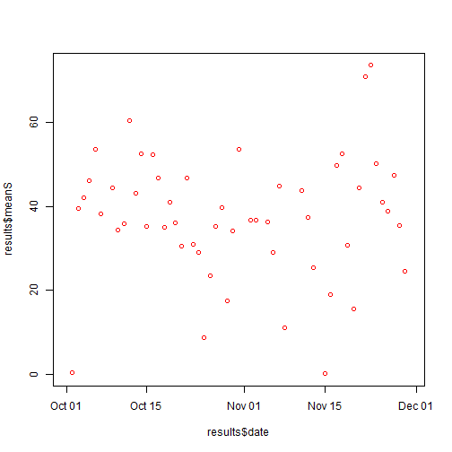
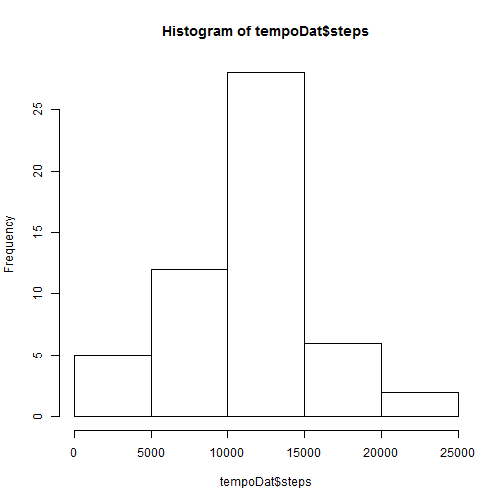
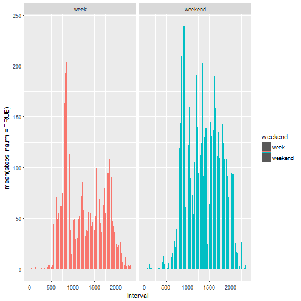

# Peer Assessement

## This is where the enthusiastic student I am starts ro learn R markdown.final version
# to see the plots, please be sure to read this in the correct html editor !

First bit of code changes the options so that the code will always be available 
in the markdown document.


```r
library(markdown)
library(knitr)
opts_chunk$set(echo = TRUE)
```

###1. Code for reading in the dataset and/or processing the data


```r
actiData<- read.csv("activity.csv")
actiData$date<- as.Date(actiData$date, "%Y-%m-%d ")
```

###2. Histogram of the total number of steps taken each day

```r
library(ggplot2)
```

```
## Warning: package 'ggplot2' was built under R version 3.3.2
```

```r
graph1<- ggplot(actiData, aes(date, steps, ))
graph1+ geom_bar(stat = "identity", na.rm = TRUE, fill = "dodgerblue4")
```

```
## Warning: Removed 2304 rows containing missing values (position_stack).
```


###3.Mean and median number of steps taken each day


```r
library(dplyr)
```

```
## 
## Attaching package: 'dplyr'
```

```
## The following objects are masked from 'package:stats':
## 
##     filter, lag
```

```
## The following objects are masked from 'package:base':
## 
##     intersect, setdiff, setequal, union
```

```r
actiDataDay<- group_by(actiData,date)
results <-summarise(actiDataDay, meanS = mean(steps, na.rm = TRUE), medianS = median(steps, na.rm = TRUE) )
print(results, n = 20)
```

```
## # A tibble: 61 × 3
##          date    meanS medianS
##        <date>    <dbl>   <dbl>
## 1  2012-10-01      NaN      NA
## 2  2012-10-02  0.43750       0
## 3  2012-10-03 39.41667       0
## 4  2012-10-04 42.06944       0
## 5  2012-10-05 46.15972       0
## 6  2012-10-06 53.54167       0
## 7  2012-10-07 38.24653       0
## 8  2012-10-08      NaN      NA
## 9  2012-10-09 44.48264       0
## 10 2012-10-10 34.37500       0
## 11 2012-10-11 35.77778       0
## 12 2012-10-12 60.35417       0
## 13 2012-10-13 43.14583       0
## 14 2012-10-14 52.42361       0
## 15 2012-10-15 35.20486       0
## 16 2012-10-16 52.37500       0
## 17 2012-10-17 46.70833       0
## 18 2012-10-18 34.91667       0
## 19 2012-10-19 41.07292       0
## 20 2012-10-20 36.09375       0
## # ... with 41 more rows
```

```r
maxMean<- which.max(results$meanS)
maxMedian<- which.max(results$medianS)
```

The maximum mean is ` maxMean `. Du to a lot of "0", most medians are "0" and the biggest median is `maxMedian`

### 4.Time series plot of the average number of steps taken


```r
plot(results$date, results$meanS, col= "red")
```



###3.The 5-minute interval that, on average, contains the maximum number of steps

```r
actiDataInterval<- group_by(actiData, interval)
actiDataInterval<- summarise(actiDataInterval, meansteps =mean(steps, na.rm = TRUE))
# That interval is interval found on line :
which.max(actiDataInterval$meansteps)
```

```
## [1] 104
```
###6.Code to describe and show a strategy for imputing missing data


```r
#Calculate and report the total number of missing values in the dataset (i.e. the total number of rows with NAs)
sum(is.na(actiData))
```

```
## [1] 2304
```

```r
#Devise a strategy for filling in all of the missing values in the dataset + Create a new dataset that is equal to the original dataset but with the missing data filled in
```

```r
meantot<- mean(actiData$steps, na.rm = T)
actiData$newSteps <- actiData$steps
actiData$newSteps[is.na(actiData$newSteps)]<- meantot
```
### 7. Histogram of the total number of steps taken each day after missing values are imputed

```r
tempoDat<- aggregate(steps ~ date, actiData, sum)
hist(tempoDat$steps)
```



### 8.Panel plot comparing the average number of steps taken per 5-minute interval across weekdays and weekends

```r
actiData<- mutate(actiData, Day = weekdays(actiData$date))
actiData<- mutate(actiData, weekend= ifelse(actiData$Day == c("Saturday", "Sunday"), "weekend", "week"))
tempoDat2 <- group_by(actiData, interval, weekend)
tempoDat2<- summarise(tempoDat2, mean(steps, na.rm = TRUE))
graph2<- ggplot(tempoDat2, aes(interval, `mean(steps, na.rm = TRUE)`, color = weekend))
graph2 + geom_bar(stat = "identity") + facet_grid(.~ tempoDat2$weekend)
```



```r
knit2html(input = "Peer Assessement.Rmd")
```

```
## 
## 
## processing file: Peer Assessement.Rmd
```

```
## Error in parse_block(g[-1], g[1], params.src): duplicate label 'setOptions'
```


